# 马士兵左程云数据结构算法进阶

# CLASS1

## 1、单调栈和窗口及其更新结构

### 1、窗口内最大值的结构

#### 原理

> 通过双端队列来进行最大值结构的实现
>
> 1、最基本的原则，双端队列从头到尾的数 是从大到小的
>
> 2、当R变化的时候，先看是否能直接加进尾部，如果不能就弹出尾部元素在进行判断(直到尾部元素大于要入队的元素或队列为空)在入队
>
> 3、当L变化的时候，看看队列头的数是不是要过期的坐标，是就弹出，不是就不弹出

**这里的双端队列就是代表谁会成为最大值的优先级（满足值比你大，坐标比你过期的晚)**

#### 代码

```java
   /*
     * @Description:
     * @Author: FULITAO
     * @param: arr,要划过的数组
     * @param: w;窗口的大小
     * @Return: int[]
     * @Date: 2021/10/8 20:55
     **/
    public static int[] getMaxWindow(int[] arr, int w) {
        if (arr == null || w < 1 || arr.length < w) {
            return null;
        }
        //LinkedList底层就是双端队列实现的 在这里放的是数组的下标
        LinkedList<Integer> qMax = new LinkedList<>();
        //这里代表结果的个数 一个窗口的大小和数组的大小就决定了结果的长度
        int[] res = new int[arr.length - w + 1];
        int index = 0;
        for (int r = 0; r < arr.length; r++) {
            //把当前窗口状态的最大值处理一下
            //当双端队列不为空而且双端队列的尾巴的值小于等于当前窗口R要入队的值的时候就弹出
            while (!qMax.isEmpty() && arr[qMax.peekLast()] <= arr[r]) {
                qMax.pollLast();
            }
            //从尾部入队 这里记录的是他的下标值
            qMax.add(r);
            //这个语句代表 窗口的左边已经划出这个队列头部的值就过期掉
            if (qMax.peekFirst() == r - w) {
                qMax.pollFirst();
            }
            //当R滑动到了大于等于窗口宽度的时候就记录当前的最大值情况
            if (r >= w - 1) {
                res[index++] = arr[qMax.peekFirst()];
            }

        }

        return res;
    }
```

### 2、题目：给定一个数组arr和一个数num某个arr的sub，如果想达标必须满足sub中的最大值减去最小值<=num,返回arr中达标数组的个数

#### 思路

> 1、从这个提议可以想到假如使用暴力方法来遍历数组的话会造成时间复杂度很高
>
> 2、采用窗口来进行处理这个题，做一个max来记录当前arr[L....R]的最大值，min记录arr[L...R]上的最小值
>
> 3、我们考虑下当在arr[L...R]上达标，L与R都缩小范围 变为arr[L'...R']是否还达标呢，答案是肯定 因为他在大范围上达标了，他在小范围上的 max和min记录结构，max只可能比他小或者等于 min只可能比他大或者等于。
>
> 4、我们考虑下当在arr[L....R]上不达标,L与R都扩大范围变为arr[L'....R']是否达标呢，答案是否定的因为他在小规模上都不达标了在大规模上的max和min的记录结构max只有可能比他大或者等于 min只有比他小或者等于。
>
> 5、根据以上四点我们就可以知道了这题的解法，我们L从0出发 R依次递增当达到了第一个不达标的点的时候R不变，我们求以L出发到R中满足的的子数组的个数即L...0 L....1  L....2 等等 然后L往右移动一位判断此时是否达标，不达标继续移动达标了就移动R直到来到下次不达标的点

#### 代码

```java
    /*
     * @Description:
     * @Author: FULITAO
     * @param: arr,所提供的的数组
     * @param: num;达标的要求
     * @Return: int
     * @Date: 2021/10/8 21:43
     **/
    public static int subArrValid(int[] arr, int num) {
        if (arr == null || arr.length == 0) {
            return 0;
        }
        //最大值的记录结构体
        LinkedList<Integer> qMax = new LinkedList<>();
        //最小值的记录结构体
        LinkedList<Integer> qMin = new LinkedList<>();
        //窗口的两个边界
        int L = 0;
        int R = 0;
        int res = 0;
        while (L < arr.length) {        //从0开始尝试所有的可能性
            while (R < arr.length) { //R是最后一个下标达标的位置的往后一个位置
                //记录最大值以及最小值的操作
                while (!qMin.isEmpty() && qMin.peekLast() >= arr[R]) {
                    qMin.pollLast();
                }
                qMin.add(R);
                while (!qMax.isEmpty() && qMax.peekLast() <= arr[R]) {
                    qMax.pollLast();
                }
                qMax.add(R);
                //当发现R来到的位置已经不满足了 就直接跳出当前循环
                if (arr[qMax.peekFirst()] - arr[qMin.peekFirst()] > num) {
                    break;
                }
                R++;
            }
            //L...R-1位置上是满足num的要求的，求出有多少个个数
            res += (R - 1) - L;
            //L要往右走一个所以要过期这两个记录里面的东西
            if (qMax.peekFirst() == L) {
                qMax.pollFirst();
            }
            if (qMin.peekFirst() == L) {
                qMin.pollFirst();
            }
            L++;
        }
        return res;
    }
```

## 2、单调栈

### 1、解决的问题

> 用于解决求在一个数组中，i位置的数左边比他小的最近的位置在哪和右边比他小的最近的位置在哪
>
> 使用暴力递归的话他的时间复杂度是O(N^2)
>
> 使用单调栈可以变为O(N);

### 2、思路

#### 1、数组没有重复值的情况

> 1、准备一个栈
>
> 2、栈中维护的顺序是从栈底到栈顶都是从小到大的
>
> 3、当遇到一个数，栈为空或者比栈顶元素还要大就直接入栈
>
> 4、遇到一个数比栈顶元素要小就释放栈顶元素，栈顶元素左边最近小于的坐标就是当前数的坐标，右边最近的数就是栈顶元素下面的一个数假如下面没数就是空
>
> 5、遍历完之后单独处理栈中剩下的元素也按第4部的思路来进行处理

#### 代码

```java
    /*
     * @Description:
     * @Author: FULITAO
     * @param: arr;目标数组
     * @Return: int[][]   第一个数组代表的是目标数组的下标，第二数组0位置代表左边的位置 1位置代表右边的位置
     * @Date: 2021/10/11 22:37
     **/
    public static int[][] getNearLessNoRepeat(int[] arr) {
        Stack<Integer> stack = new Stack<>();
        int[][] answear = new int[arr.length][2];
        for (int i = 0; i < arr.length; i++) {
            //当栈中为空 或者栈中的栈顶元素小于当前元素就直接入栈
            if (stack.isEmpty() || arr[stack.peek()] < arr[i]) {
                //栈中存的是下标值
                stack.add(i);
                continue;
            }
            while (!stack.isEmpty()&&arr[stack.peek()] > arr[i]) {
                Integer releaseIndex = stack.pop();
                answear[releaseIndex][1] = i;
                //看看当前要释放的位置下一个位置是否有元素
                int stackNext = stack.isEmpty() ? -1 : stack.peek();
                answear[releaseIndex][0] = stackNext;
            }
            stack.add(i);
        }
        while(!stack.isEmpty()){
            int releaseIndex = stack.pop();
            int stackNext=stack.isEmpty()?-1:stack.peek();
            answear[releaseIndex][1]=-1;
            answear[releaseIndex][0]=stackNext;
        }
        return answear;
    }
```

#### 2、数组有重复值的情况

> 1、总体思路和没重复值相同，但是在栈中压得是一个集合类型
>
> 2、当一个数要释放栈中的数的时候右边还是当前index，左边是他在栈中下面的集合中的最右边的位置

#### 代码

```java
    public static int[][] getNearLessRepeat(int[] arr) {
        int[][] answer = new int[arr.length][2];
        //单调栈
        Stack<List<Integer>> stack = new Stack<>();
        for (int i = 0; i < arr.length; i++) {
            while (!stack.isEmpty() && arr[stack.peek().get(0)] > arr[i]) {
                List<Integer> popList = stack.pop();
                //判断当前弹出的元素往下是否还有元素 没有就返回-1 如果有取那个list的最后一个坐标
                int lessLeftIndex = stack.isEmpty() ? -1 : stack.peek().get(stack.peek().size() - 1);
                for (Integer pop : popList) {
                    answer[pop][1] = i;
                    answer[pop][0] = lessLeftIndex;
                }
            }
            if (!stack.isEmpty()&&arr[stack.peek().get(0)]==arr[i]) {
                stack.peek().add(i);
            } else {
                List<Integer> list = new ArrayList<>();
                list.add(i);
                stack.push(list);
            }
        }
        while (!stack.isEmpty()) {
            List<Integer> popList = stack.pop();
            int lessLeftIndex = stack.isEmpty() ? -1 : stack.peek().get(stack.peek().size() - 1);
            for (Integer pop : popList) {
                answer[pop][1]=-1;
                answer[pop][0]=lessLeftIndex;
            }
        }
        return answer;
    }
```

### 3、题目:给定一个只包含正整数的数组arr，arr中任何一个子数组的sub一定可以计算（sub累加和)*(sub中最小值)是什么，那么子数组中，最大值是多少?

#### 思路

##### 前序工作:假如需要求数组的arr[l...r]上的累加和怎么可以做到时间复杂度最低的情况呢？，这个时候可以采用前缀累加和，建立一个sum数组他的数组长度和原数组长度一样当sum[0]位置代表的是arr[0...0]位置上的和,sum[1]代表的是arr[0...1]上的和以此类推 求arr[l...r]上的累加和即sum[r]-sum[l]位置即可

**代码**

```java
   public static int sumPrefix(int[] arr, int l, int r) {
        int[] sum = new int[arr.length];
        sum[0] = arr[0];
        for (int i = 1; i < sum.length; i++) {
            sum[i] = sum[i - 1] + arr[i];
        }
        return sum[r] - sum[l];
    }
```

> 根据提议我们需要(sub数组的累加和)*(sub数组的最小值)，我们可以知道当我们选定某一个子数组的最小值他扩的范围越大他最终的值也就是越大，所以我们建立了一种单调性和范围之间的关系。有了这个前提我们就可以利用单调栈，假设i位置的数围着个数组的最小值，他在左边遇到的第一个比他小的值坐标是啥，右边第一个比他小的值是啥 然后我们求出这个范围的累加和 * i当前的数就得到了这个子数组的(sub数组的累加和)*(sub数组的最小值) 我们遍历一次数组就能得出了最大值是啥

#### **代码**

```java
package class01;

import java.util.ArrayList;
import java.util.List;
import java.util.Stack;

/**
 * @ClassName: SubArrMaxNum.java
 * @author: FLT
 * @description:单调栈求子数组中 (sub累加和)*(sub中最小值) 的最大
 * @createTime: 2021年10月12日 22:08:00
 */
public class SubArrMaxNums {

    public static int subArrMaxNum(int[] arr) {
        int answer = 0;
        //先计算整个数组上的每个位置的累加和
        int[] sum = new int[arr.length];
        sum[0] = arr[0];
        for (int i = 1; i < sum.length; i++) {
            sum[i] = sum[i - 1] + arr[i];
        }

        //利用单调栈 求出一个坐标上的左边第一个比他小的值 右边第一个比他小的值
        int[][] limit = getNearLess(arr);

        //遍历这个数组求出最大的子数组 (sub累加和)*(sub中最小值)
        for (int i = 0; i < arr.length; i++) {
            int leftLimit = limit[i][0] == -1 ? 1 : limit[i][0] + 1;
            int rightLimit = limit[i][1] == -1 ? arr.length - 1 : limit[i][1] - 1;
            answer = Math.max(sum[rightLimit] - sum[leftLimit - 1] * arr[i], answer);
        }


        return answer;
    }

    //求出左边第一个比他小的坐标 和右边第一个比他小的坐标
    public static int[][] getNearLess(int[] arr) {
        int[][] answer = new int[arr.length][2];
        //单调栈
        Stack<List<Integer>> stack = new Stack<>();
        for (int i = 0; i < arr.length; i++) {
            while (!stack.isEmpty() && arr[stack.peek().get(0)] > arr[i]) {
                List<Integer> popList = stack.pop();
                //判断当前弹出的元素往下是否还有元素 没有就返回-1 如果有取那个list的最后一个坐标
                int lessLeftIndex = stack.isEmpty() ? -1 : stack.peek().get(stack.peek().size() - 1);
                for (Integer pop : popList) {
                    answer[pop][1] = i;
                    answer[pop][0] = lessLeftIndex;
                }
            }
            if (!stack.isEmpty() && arr[stack.peek().get(0)] == arr[i]) {
                stack.peek().add(i);
            } else {
                List<Integer> list = new ArrayList<>();
                list.add(i);
                stack.push(list);
            }
        }
        while (!stack.isEmpty()) {
            List<Integer> popList = stack.pop();
            int lessLeftIndex = stack.isEmpty() ? -1 : stack.peek().get(stack.peek().size() - 1);
            for (Integer pop : popList) {
                answer[pop][1] = -1;
                answer[pop][0] = lessLeftIndex;
            }
        }
        return answer;
    }
}
```

# CLASS2

## 1、一种类似斐波那契数组的递归式

### 问题

> 我们知道 一个斐波那契递归式求 第N项的值的时候有以下表达是 F(N)=F(N-1)+F(N-2) 根据表达式我们可以知道使用递归来求斐波那契他的时间复杂度是O(N)有没有一种方法能让时间复杂度降为O(log2(N))呢？答案是有的我们看下面的推广

### 1、矩阵快速幂推广

**1->根据斐波那契递归式子我们可以知道在递归过程中里面有状态转移他严格按照F(N)=F(N-1)+F(N-2)来进行的，根据线性代数我们可以设|F4,F3|=|F2,F1|乘以一个二阶的矩阵:**


**根据上面的两个式子我们可以求出这个二阶矩阵分别的值是啥**


**得到了这个矩阵的值;然后我们在进行进步一推广**


**最后得出一个通向公式：**


**我们把计算一个斐波那契乘以N项的式子变为一个|F2,F1|的行列式乘以一个矩阵的N-2次幂的值，只要我们知道如何快速的计算出矩阵幂就能把时间复杂度降下来在此之前我们先了解如何快速计算一个常数的幂次，这里和JDK里面的Math.power方法实现一致:**

### 2、常数项如何快速求n次幂

>   我们把他要乘的|M|^n幂次转换成二进制模式，准备一个res=1,temp=[M]^1 当遇到二进制上有一的地方就把temp乘进结果，如果没有就temp单独的变化，我们就能把一个O(N)的时间复杂度的N次幂计算转换成log2(N)复杂度的计算

**代码**

```java
    //number:要求n次幂的数
    //n:要求几次
    public static int fastNumberPower(int number,int n){
        //主要思想是 number 的n次乘 把n转换成二进制就能实现log2(n)的时间复杂度
        //res=1的时候代表0项的时候
        int res=1;
        //准备一个temp记录他的一次幂
        int temp=number;
        int p=n;
        //每计算过一次幂就右移1位置
        for (; p != 0; p >>= 1) {
            //当最右边的为1的时候说明这个时候需要把temp*进去res中
            if ((p & 1) == 1) {
                res*=temp;
            }
            //不然temp就自己相乘
            temp*=temp;
        }

        return res;
    }
```

### 3、矩阵的快速幂

> 我们知道了上面如何计算常数的快速幂之后，我们就可以知道矩阵同样也可以使用那样的思路 只是在一开始res=单位矩阵（单位矩阵就是在矩阵的对角线上都是1，其他位置都为0）

**代码**

```java
   //matrix:所求的矩阵;n要求的n次方
    public static int[][] fastMatrixPower(int[][] matrix, int n) {
        int[][] res = new int[matrix.length][matrix[0].length];
        //把res初始化为单位矩阵 对角线上为1其他地方都为0
        for (int i = 0; i < matrix.length; i++) {
            res[i][i] = 1;
        }
        int p = n;
        int[][] temp = matrix;
        for (; p != 0; p >>= 1) {
            if ((p & 1) == 1) {
                res = multipleMatrix(res, matrix);
            }
            temp=multipleMatrix(matrix,matrix);
        }

        return res;
    }

    //计算两个矩阵的乘积
    public static int[][] multipleMatrix(int[][] m1, int[][] m2) {
        int[][] res = new int[m1.length][m2[0].length];
        for (int i = 0; i < m1.length; i++) {
            for (int j = 0; j < m2[0].length; j++) {
                for (int k = 0; k < m2.length; k++) {
                    res[i][j] += m1[i][j] * m2[k][j];
                }
            }
        }


        return res;
    }
```

### 答案

**所以了解以上的代码之后我们可以知道Fn=|Fn,Fn-1|* matrix^n-2[0]就是Fn的值**

```java
    //通过矩阵快速幂求斐波那契额数列
    public static int f1(int n){
        if(n<0){
            return 0;
        }
        if(n==1||n==2){
            return 1;
        }
        //这个就是表达式中|Fn,Fn-2|=|1,1|* matrix^n-2的哪个矩阵
        int[][] baseMatrix={
                {1,1},
                {1,0}
            };

        int[][] res=FastMatrixPowerDemo.fastMatrixPower(baseMatrix,n-2);

        return res[0][0]+res[1][0];
    }s
```

### 4、奶牛问题

##### 假如一个工厂的所有奶牛都不会死，第一年有一条奶牛当奶牛来到了第三年的时候他就会生一个小牛，小妞过了三年之后也会生一个牛，请问第N年的时候一共有多少条牛

> 根据问题我们大概可以知道，这个也是没有状态转移的一个多项式问题我们先列出前几年的情况找到F(N)究竟与那些F(?)函数有关
>
> 第一年  第二年  第三年  第四年(A成熟了可以生牛了)    第五年     第六年        
>
> ​    A           A            A            A                                               A                 A               
>
> ​											   B                                                B (A)          B(A)
>
> ​                                                                                                   C(A)          C(A)
>
> ​                                                                                                                     D(A)
>
> 通过上面的例子我们可以知道F(n)=F(N-1)+F(N-3)  即上一年存活牛的数量加上前三年存活牛的数量 就等于当前N的所有牛
>
> 这个式子其实是个三项 因为F(N)=1*F(N-1)+0 * F(N-2)+ 1* F(N-3)
>
> 我们也可以借助矩阵快速幂推断出来这个
>
> [F(N),F(N-1),F(N-2)]=[F(N-1),F(N-2),F(N-3)]*一个3 X 3的举证

​       

### 5、给定一个数N，想象只由0和1两种字符，组成的所有长度为N的字符串如果某个字符串的，任何0字符串的左边都有1说明这个字符串达标，返回有多少达标的字符串


### 6、给定一个宽为2长为N的区域，提供2*1大小的瓷砖，请问有多少种方法把这个2 * N的面积填满

**第一种方式：第一块瓷砖竖着摆**


**第一块瓷砖竖着摆，即求剩下的N-1长度的情况**


**第二种方式：使用两块瓷砖横着摆**


**两块瓷砖横着白，即求剩下的N-2长度的情况**


> 所以有公式:F(N)=F(N-1)+F(N-2)

## 2、蓄水池算法

> 假如有一个会吐球的源头，需要收集10个球提供一个容器他的大小就是10个，如何保证这收集到的10个球的概率都是相等的？
>
> 这个就是常见的蓄水池算法的定义，在很多场合中我们都需要保证等概率发生时间，比如抽奖；如何保证等概率就是这个算法思想要解决的目标
>
> 这个算法的流程就是:
>
> ​		假设结果集需要k个元素，首先从源头中取出k个元素进结果集，然后再从k+1=i往后遍历
>
>  		k+1=i个元素能进结果集的概率是 i/k *  1/k的概率他才能进结果集

**证明**


# CLASS3

## 1、KMP算法

**这个算法主要解决的就是字符串是否出现在另外个字符串的子串中，即Java String的indexOf算法**

**暴力解法：有str的长度为N，match长度为M判断match是否存在于str的子串中，如果有返回第一次出现的下标**

> 这样我们得遍历两个字符串，str i位置开始一直往后递归 match也是0位置往后递归，当发现不相等的时候 i变为从i+1 match在重新从0开始进行比较，很明显这个暴力方法的时间复杂度是O(M*N)


**构建一个通过match表示当前位置前缀猴嘴最长字符串的长度（不包含最大长度)如下:**

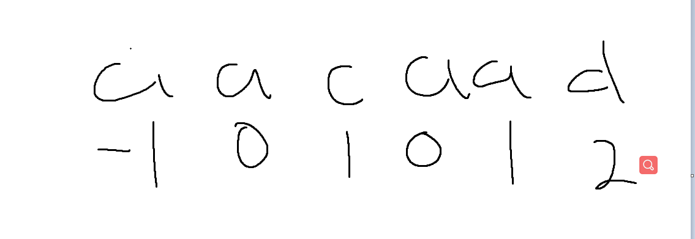

> 我们规定
>
> 字符串0位置的前缀最长子字符串的长度为-1
>
> 字符串1位置前缀最长子字符串的长度为0
>
> 例如上面这个例子2位置他的前缀后缀最长相等子字符串的长度为1，即 a  a  不包含2长度的
>
> 我们根据这个规则就可以构建出来这个关系这个关系有何作用呢。
>
> 我们发现暴力解法的时间复杂度最大的消耗就是假如 str i位置的字符与 match j位置的字符串不匹配的时候 i回退到i+1 j回退到0位置重新开始进行配对
>
> 我们有了这个的时候就可以使得i和j少回退点位置减少比较的复杂度

**原理**

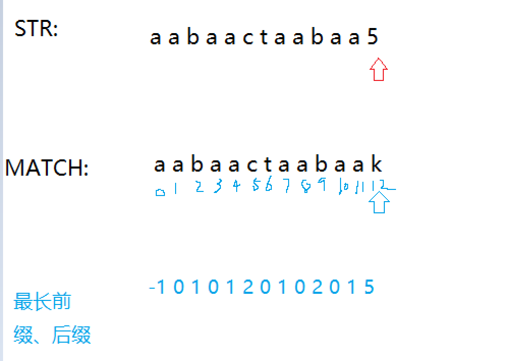

**当来到第一个不匹配位置的坐标的时候，i位置保持不变，j位置回调到当前坐标下存的最长前缀和后缀的位置 即回到5位置**

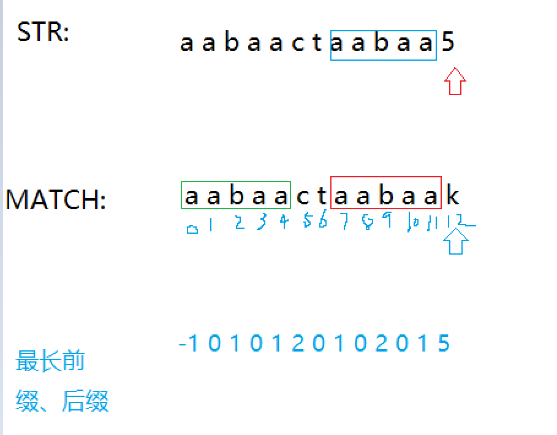

**这个为什么可以I位置不动只需要动j位置呢，因为蓝色部分等于红色部分，又因为是最长前缀和后缀所以蓝色部分也等于绿色部分，随意我们知道当前i位置以前的字符串5都是相等，我们就可以从match j=5前缀匹配的下个位置继续往下匹配**

**直到遍历到match最长前缀后缀等于-1的时候代表实在从当前i位置比较无法匹配此时i+1在进行上面的操作**

**其实虽然说i位置不对，当时我们开始时的是match的那个值开始的在str下的坐标往后的字符串开始配**

**下面以index代表str要匹配的字符串坐标，i位置代表匹配的开始坐标，j位置代表match要匹配字符串的坐标**

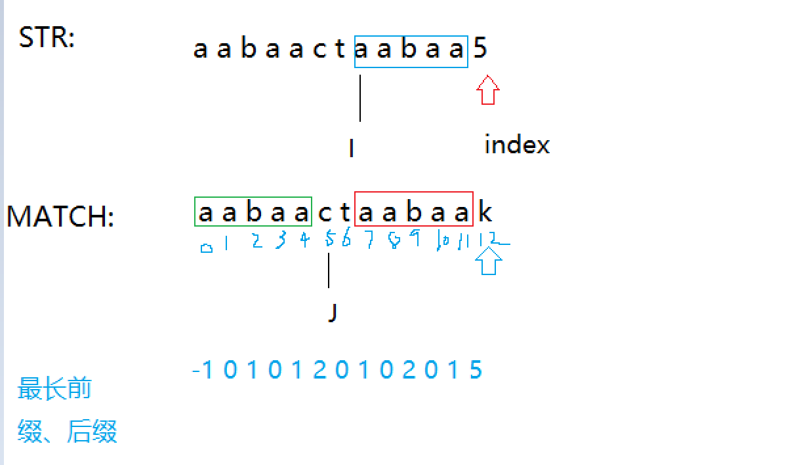

```java
package class03;

import java.util.Arrays;

/**
 * @ClassName: StringContainsForBFP.java
 * @author: FLT
 * @description: 通过BFP算法实现String类中的indexOf算法
 * @createTime: 2021年11月23日 21:06:00
 */
public class StringContainsForKMP {
    public static void main(String[] args) {
        String str="aabaacddeef";
        String match="ddeefa";
        System.out.println(getIndexOf(str, match));
    }
    public static int getIndexOf(String s, String m) {
        if (m == null || s == null || m.length() == 0 || s.length() == 0||m.length()>s.length()) {
            return -1;
        }
        char[] str = s.toCharArray();
        char[] match = m.toCharArray();
        int x = 0;
        int y = 0;
        int[] next = getNextArr(match);
        while (x < str.length && y < str.length) {
            if (str[x] == match[y]) {
                x++;
                y++;
            } else if (next[y] == -1) {
                x++;
            } else {
                y = next[y];
            }
        }

        return y == match.length ? x - y : -1;
    }

    public static int[] getNextArr(char[] match) {
        int[] next = new int[match.length];
        next[0] = -1;
        next[1] = 0;
        String str = new String(match);
        for (int i = 2; i < match.length; i++) {
            int count = 0;
            for (int j = 0; j < i - 1; j++) {
                if (str.substring(0, j+1).equals(str.substring(i - j - 1, i))) {
                    count++;
                }
            }
            next[i] = count;
        }
        return next;
    }
}
```

**如何证明上面的算法的时间复杂度是O(n)的呢？**

**严谨的证明:**

>  如何证明进入while的次数就是这个代表时间复杂度的关键，这里我们定义了两个量 X(最大值为N)，X-Y（最大值也是N)他有以下的趋势

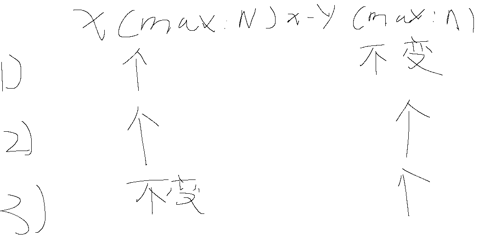

**分支1，分支3，分支4的情况都列出来了，他们的最大次数为2N所以这个时间复杂度为O(N)**


**这里我们在看下NEXT数组如何求对，以及他的时间复杂度**

> Match字符串的长度为M ，我们只需要证明这个方法getNextArr()的时间复杂度为O(M) 根据已知条件N>=M所以这个方法的时间复杂度收敛为O(N)

**思想:我们可以知道next数组里面存的是当前下标的最大前缀和后缀相匹配的长度，这个能告诉些我们什么呢？可以告诉我们假如我们match求到了i位置，我们可以通过前面i-1下标的信息快速知道i位置的信息我们看下面的图**

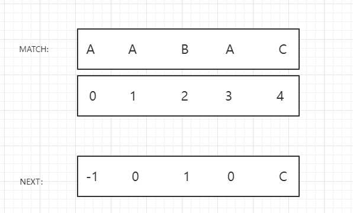

**当来到了i=4的时候我们看看i-1即位置3的next数组存的最大前缀后缀匹配长度为0，此时我们调到match数组下标位置为0的时候看match[0]是否等于match[3]如果等于就是当前match[3]的值+1**

**为什么呢？**

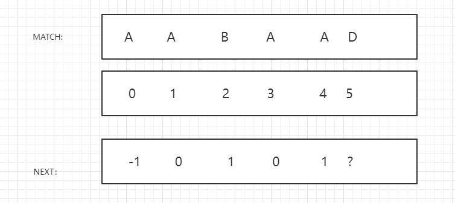

**我们看到上面i来到了位置5上 i-1位置的next值是1 当match[next[i-1]=match[i]的时候 next[i]=next[i-1]+1**

**证明**

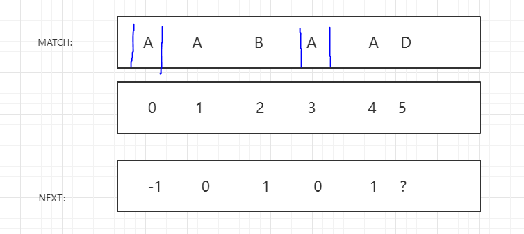

**next[4]的最长前缀和后缀匹配长度为1，即蓝色圈起来的部分。首先我们要理解next数组里面存的值不仅仅代表的是最长前缀后缀匹配长度，也是最终到达不匹配的下标。所以当最终不匹配的下标等于match[4]位置的时候 next就等于 next[4]+1(红色标记的)**

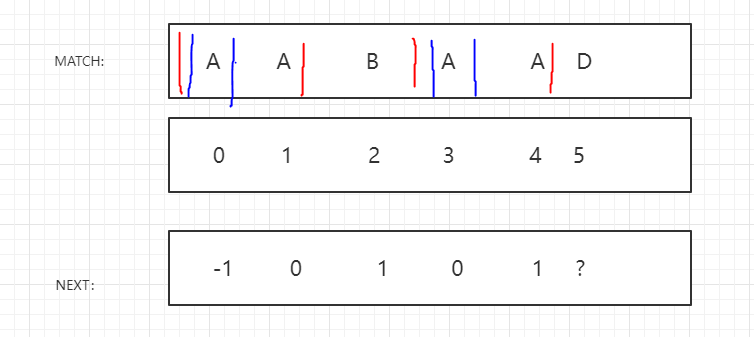

```java
 public static int[] getNextArr(char[] match) {
        if (match.length == 1) {
            return new int[]{-1};
        }
        int[] next = new int[match.length];
        next[0] = -1;
        next[1] = 0;
        //这里的cn代表的是next下存的最长前缀后缀匹配长度信息，并且是要和i-1比较字符的下标
        // 初始化为0因为i是从2开始  我们知道 下标为0的时候 next数组存的是-1
        //下标为1的时候数组存的是0
        //从 2开始 即 i-1的信息就是0
        int cn = 0;
        int i = 2;
        while (i < match.length) {
            if (match[cn] == match[i - 1]) {
                next[i++] = ++cn;
            } else if (cn > 0) {
                cn = next[cn];
            } else {
                next[i++] = 0;
            }
        }
        return next;
    }
```

**这个时间复杂度和上面的证明方法大同小异**

## 2、KMP算法扩展

### 1、判断str2是否是str2的一个旋转字符

> 定义：
>
> ​	旋转字符的定义为 比如str1=12345 他的旋转字符串有23451、34512、45123 、51234
>
> 要是使用暴力解法来解的话他的时间复杂度是O(N^2)，因为他吧str1变为一个类似于环的字符串从0位置出发一直遍历到最后一个字符串看是否相等于这个str2 
>
> ​	此时我们可以借用KMP算法，首先把str1拷贝一份拼接到原始的str1后背 例如 str1=12345 str1’=1234512345 判断str2是否是这个str1‘的子字符串即可

```java
package class03;

/**
 * @ClassName: IsRotationStrDemo.java
 * @author: FLT
 * @description:是否是旋转字符串的代码
 * @createTime: 2021年11月24日 21:14:00
 */
public class IsRotationStrDemo {
    public static void main(String[] args) {
        String str1 = "12345";
        String str2 = "21234";
        System.out.println(isRotationStr(str1,str2));
    }

    public static boolean isRotationStr(String str1, String str2) {
        if (str1 == null || str2 == null || str1.length() != str2.length()) {
            return false;
        }
        //拼接出新的str1出来即str1‘=str1+str1；
        str1 = str1 + str1;
        //假如str2是这个新的拼接字符串的子字符串即为旋转字符串
        return getIndexOf(str1, str2) > 0;

    }


    //下面都是KMP算法的实现
    public static int getIndexOf(String s, String m) {
        if (m == null || s == null || m.length() == 0 || s.length() == 0 || m.length() > s.length()) {
            return -1;
        }
        char[] str = s.toCharArray();
        char[] match = m.toCharArray();
        int x = 0;
        int y = 0;
        int[] next = getNextArr(match);
        while (x < str.length && y < match.length) {
            if (str[x] == match[y]) {
                x++;
                y++;
            } else if (next[y] == -1) {
                x++;
            } else {
                y = next[y];
            }
        }

        return y == match.length ? x - y : -1;
    }

    public static int[] getNextArr(char[] match) {
        if (match.length == 1) {
            return new int[]{-1};
        }
        int[] next = new int[match.length];
        next[0] = -1;
        next[1] = 0;
        //这里的cn代表的是next下存的最长前缀后缀匹配长度信息，并且是要和i-1比较字符的下标
        // 初始化为0因为i是从2开始  我们知道 下标为0的时候 next数组存的是-1
        //下标为1的时候数组存的是0
        //从 2开始 即 i-1的信息就是0
        int cn = 0;
        int i = 2;
        while (i < match.length) {
            if (match[cn] == match[i - 1]) {
                next[i++] = ++cn;
            } else if (cn > 0) {
                cn = next[cn];
            } else {
                next[i++] = 0;
            }
        }
        return next;
    }
}
```

### 2、给两个二叉树一个为T1，另一个为T2请问如何判断T2是否是T1一颗结构完全相同的子树

**暴力解法:**

```java
 //暴力解法
    //这个方法是选中一个节点作为头 来进行比较
    public static boolean containsTree1(TreeNode big, TreeNode small) {

        if (small == null) {
            return true;
        }
        if (big == null) {
            return false;
        }
        if (isSameValueStructure(big, small)) {
            return true;
        }
        //这里的情况是当前作为头结点的节点 t2不满足 就去他的左子树上看 和右子树上看

        return containsTree1(big.left, small) || containsTree1(big.right, small);
    }

    //这个方法是从选中的头结点往下依次左比较
    public static boolean isSameValueStructure(TreeNode head1, TreeNode head2) {
        // 过滤条件
        if (head1 == null && head2 != null) {
            return false;
        }
        if (head1 != null && head2 == null) {
            return false;
        }
        if (head1 == null && head2 == null) {
            return true;
        }
        //当 head1和head2都不为空的时候比较这节点的值不相同直接retun false；
        if (head1.val != head2.val) {
            return false;
        }
        //表示上面的条件都满足 即 head1！=null&&head2!=null&&head1.val==head2.val 就要去看
        //这两个节点的左边的节点是否满足 和右边的节点是否满足 都满足才是结构完全相同的树
        return isSameValueStructure(head1.left, head2.left) && isSameValueStructure(head1.right, head2.right);
    }
```

**根据代码我们可以看出最坏的情况下 T1 N个节点都要遍历 T2 M个节点都要遍历 所以他的时间复杂度是 O(N*M)**

**利用KMP算法：两棵树都通过前序序列化的方式来序列化，判断T2序列化的字符串是否是T1的子字符串即可**

**1.0**

```java
 public static boolean containsTree1ForKMP(TreeNode big, TreeNode small) {
        if (big == null) {
            return false;
        }
        if (small == null) {
            return true;
        }
        String str1 = preOrder(big);
        String str2 = preOrder(small);
        //这里调的是KMP算法
        return IsRotationStrDemo.getIndexOf(str1, str2)!=-1;
    }


    //利用KMP算法
    public static String preOrder(TreeNode head) {
        StringBuilder res = new StringBuilder("");
        process(head, res);

        return res.toString();
    }

    public static void process(TreeNode head, StringBuilder res) {
      	if (head == null) {
            res.append("null");
            return;
        }
        res.append(head.val);
        process(head.left, res);
        process(head.right, res);
    }
```

## 3、BFPRT算法

### 1、常规解法

> 给定一个无序数组，要求你在O(logN)的时间复杂度下找到第K小的数
>
> 我们可以借助荷兰国旗问题还有随机快排的概念来做比如下面的代码他的时间复杂度是O(N)但是他是通过数学概率求期望得到的如何严格的用流程得到更好的算法呢？

```java
  public static int process(int[] arr, int l, int r, int index) {
        if (l == r) {
            return arr[l];
        }
        //随机选取一个数来作为样本比较
        int pivot = arr[(int) ((r - l) * Math.random())];
        //进行荷兰国旗问题 找到等于区的上边界下边界
        int[] range = partition(arr, l, r, pivot);
        //这里的range 和index比较包含了一些隐藏的说明
        //假如index是在有序数组中 他和在这个边界之中就说明arr[index]就等于这个边界的数
        //比他小的话就考虑他左边
        //比他大就考虑他的右边
        if (index >= range[0] && index <= range[1]) {
            return arr[index];
        } else if (index < range[0]) {
            return process(arr, l, range[0] - 1, index);
        } else {
            return process(arr, range[0] + 1, r, index);
        }
    }

    public static int[] partition(int[] arr, int l, int r, int pivot) {
        int less = l - 1;
        int more = r + 1;
        int cur = l;

        while (cur < more) {
            if (arr[cur] == pivot) {
                cur++;
            } else if (arr[cur] < pivot) {
                swap(arr, cur++, ++less);
            } else {
                swap(arr, cur++, --more);
            }
        }
        return new int[]{less + 1, more - 1};
    }
```

### 2、BFPRT解法

bfprt解法和常规解法唯一不同的就是在number的选取上，其他地方一模一样，所以我们只讲选取number这一过程。

第一步：我们将数组每5个相邻的数分成一组，后面的数如果不够5个数也分成一组。

第二步：对于每组数，我们找出这5个数的中位数，将所有组的中位数构成一个median数组（中位数数组）。

第三步：我们再求这个中位数数组中的中位数，此时所求出的中位数就是那个number。

第四步：通过这个number进行partation过程，下面和常规解法就一样了。

接下来我们分析一下为什么bfprt算法每次选number的时候都能够在数组的中间位置。

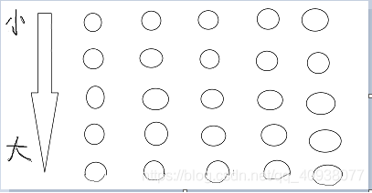

我们假设这就是分出来的每5个数的小组，每一列代表一个小组。

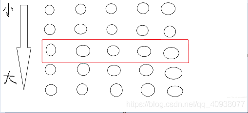

 

 

图中红框内的数我们假设就是每一组的中位数。我们假设总数组的数字个数是N，那么中位数数组中数字的个数就是 N / 5 。

 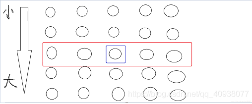


我们假设用蓝框框起来的数是中位数数组的中位数（divide），那么由中位数的性质可知，中位数数组中有一半的数比这个divide大，所以总共有 N / 10个数比这个divide大。

 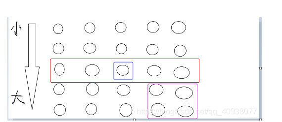


用紫色框框出的数肯定也是比divide大，所以至少有N / 10 + ( 2*N ) / 10 = ( 3*N ) / 10 个数比divide大，那么以divide为划分的partation过程能够使得divide在数组的靠近中间的位置，最坏情况也能够在数组的 ( 3*N ) / 10 或者 ( 7*N ) / 10 的位置。时间复杂度为O（N）。

**最后时间复杂度 T(N)=O(N)+T(N/5)+T(7N/10)数学最后推出 时间复杂度是O(N)**

```java
  //通过 BFPRT来解决TOP-K的方法
    public static int topKSolutionForBFPRT(int[] arr, int k) {
        return bfprt(arr, 0, arr.length - 1, k - 1);
    }

    //假设排序的话 位于arr[index]上的数是什么
    public static int bfprt(int[] arr, int l, int r, int index) {
        if (l == r) {
            return arr[l];
        }
        int pivot = medianOfMedians(arr, l, r);
        int[] range = partition(arr, l, r, pivot);
        if (index >= range[0] && index <= range[1]) {
            return arr[index];
        } else if (index < range[0]) {
           return bfprt(arr, l, range[0] - 1, index);
        } else {
            return  bfprt(arr, range[1] + 1, r, index);
        }

    }

    //在BFPT算法中 通过尽量挑选在数组排序中最位于中间位置的数 来实现O(N)的复杂度
    //这个方法就是完成 把一个数组五个一组分组 排序在把他们的中位数单独拎出来形成一个新的数组
    //返回这个新生成的数组中的中位数
    public static int medianOfMedians(int[] arr, int l, int r) {
        int size = r - l + 1;
        int offset = size % 5 == 0 ? 0 : 1;
        //新生成的中位数数组 的长度是原数组的 size/5+offset 因为最后一组可能不达到5个
        int[] mArr = new int[size / 5 + offset];
        for (int team = 0; team < mArr.length; team++) {
            int teamFirst = team * 5;
            //为啥右边界得靠Math.min来选择呢 因为可能最后一组不到五个
            mArr[team] = getMedian(arr, teamFirst, Math.min(teamFirst + 4, r));
        }

        //找到新数组的中位数
        return bfprt(mArr, 0, mArr.length-1, mArr.length / 2);
    }

    public static int getMedian(int[] arr, int l, int r) {
        insertSort(arr, l, r);
        return arr[r + l / 2];
    }

    //为啥选择 选择排序来进行呢 因为这个排序算法的常数项最低
    public static void insertSort(int[] arr, int l, int r) {
        //选择排序的思想是  0~1上有序 0~i上有序
        //因为0~0上只有一个数就天然有序
        for (int i = l + 1; i <= r; i++) {
            for (int j = i - 1; j >= l && arr[j] > arr[j + 1]; j--) {
                int temp = arr[j];
                arr[j] = arr[j + 1];
                arr[j + 1] = temp;
            }
        }
    }
```

